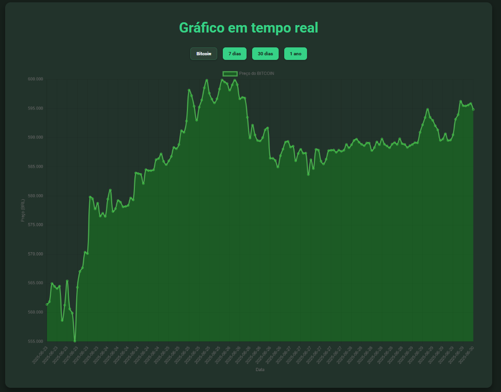
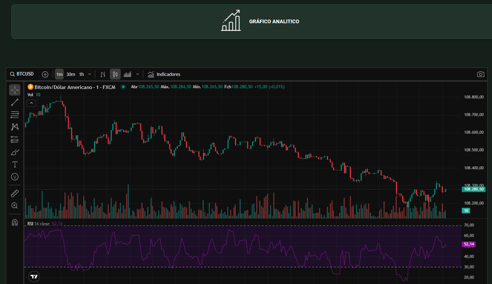
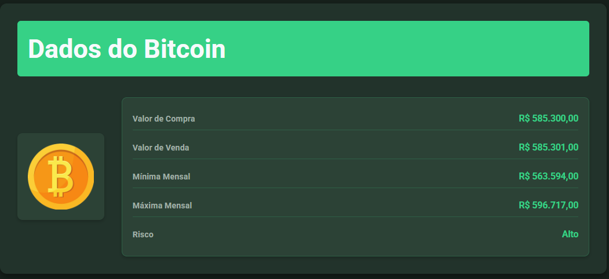

# 💸 Moneta

Uma plataforma moderna voltada para o público jovem que deseja aprender mais sobre investimentos e tomar melhores decisões no mercado financeiro.

---

## 🧠 Sobre o Projeto

O **Moneta** foi desenvolvido com a ideia de ser um "Duolingo dos investimentos", unindo **design atrativo** com **informações financeiras úteis e em tempo real**. A plataforma oferece uma experiência dinâmica e interativa para quem está começando a investir ou quer se manter atualizado.

---

## 🚀 Funcionalidades

- 📊 Gráficos genéricos e analíticos integrados com Power BI
- 💬 Sistema de notificação via WhatsApp com cotação e variação do ativo
- 📰 Feed com as últimas notícias sobre o mercado
- 💱 Conversor de moedas atualizado em tempo real
- 💡 Sugestões de preços ideais para compra e venda de ativos

---

## 🛠️ Tecnologias Utilizadas

- **Front-end:** HTML, CSS, JavaScript  
- **Back-end:** PHP, Python  
- **Banco de Dados:** MySQL  
- **APIs e Serviços:** Uvicorn + FastAPI, Power BI  
- **Notificações:** Integração via WhatsApp  
- **Outros:** CoinGecko API (ou Binance API)

---

## 🖥️ Como Rodar o Projeto

```bash
# Clone o repositório
git clone https://github.com/seu-usuario/moneta

# Entre na pasta do projeto
cd moneta

# Vá para a pasta Python e instale as dependências
cd Python
pip install -r requirements.txt

# Inicie a API (necessária para o funcionamento do site)
uvicorn api:app --reload


---

## 📸 Interface da Plataforma

### 🖼️ Página Inicial


### 📊 Gráfico em Tempo Real


### 📈 Painel Analítico


### 📋 Tabela de Dados do Ativo


---